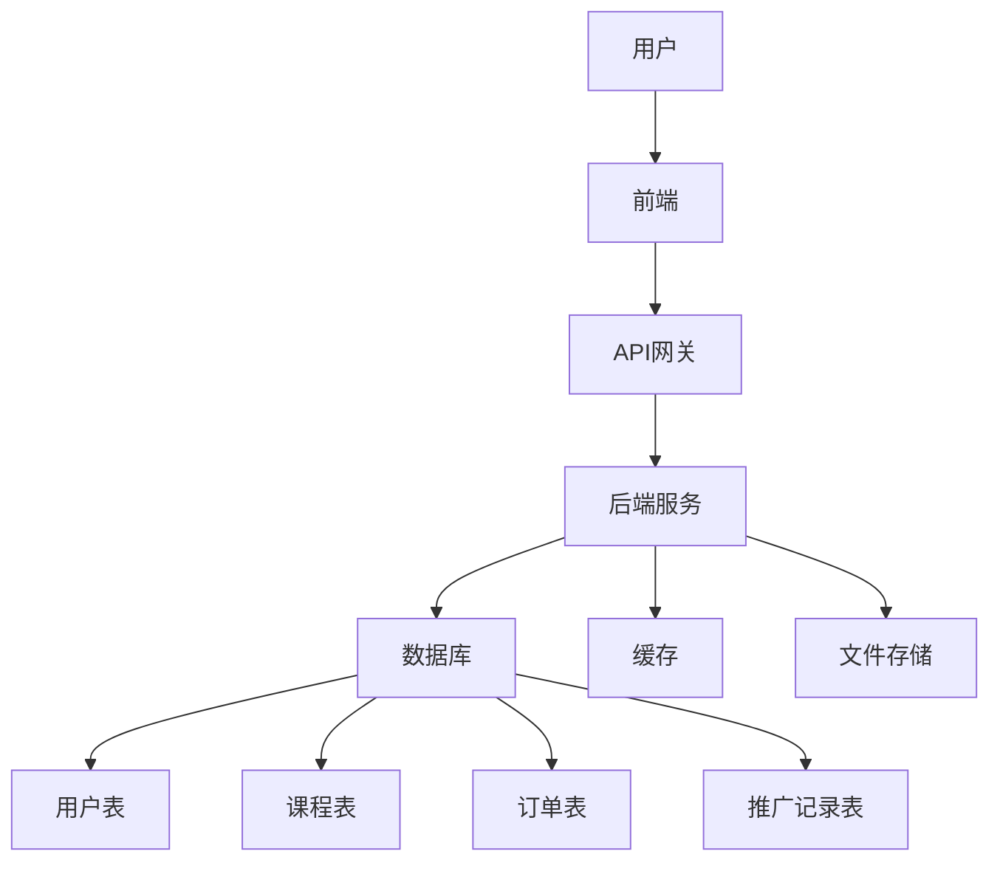

### 架构设计文档

#### 1. 系统架构图

#### 2. 微服务架构
- **服务拆分**：
    - 用户服务：负责用户注册、登录、个人信息管理。
    - 课程服务：负责课程发布、编辑、删除。
    - 推广服务：负责推广链接生成、佣金计算。
    - 后台管理服务：负责文章管理、用户管理、数据统计。
- **通信方式**：
    - RESTful API：前后端通信。
    - RPC（如gRPC）：微服务之间通信。

#### 3. 数据流设计
- **用户请求**：
    - 用户通过前端发起请求，经过API网关转发到对应的服务。
- **数据存储**：
    - 结构化数据存储在关系型数据库中。
    - 缓存热点数据到Redis中，减少数据库压力。
- **文件存储**：
    - 课程封面图、视频等大文件存储在对象存储（如阿里云OSS）中。

#### 4. 安全设计
- **权限控制**：
    - 基于角色的权限管理（RBAC）。
    - 不同会员等级拥有不同的权限（如VIP会员可访问付费课程）。
    - 永久会员拥有访问所有资源的权限，并享有推广分成的70%。
- **数据加密**：
    - 敏感数据（如密码、支付信息）使用AES加密存储。

---